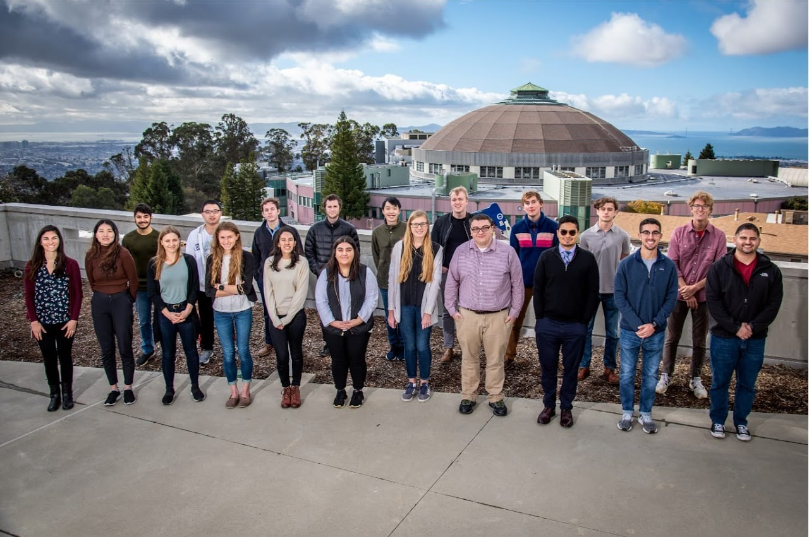

### Undergraduates/Post Bachelors: 

If you're passionate about research and interested in the prospects of graduate school, I would highly suggest conducting an internship at a national laboratory! I was a 2x Science Undergraduate Lab Intern at Lawrence Berkeley National Lab, having worked with different mentors for each internship. If you have any questions regarding the application process, the internship program or any other questions, shoot me an email: elmera[at]ucsb.edu.

### Links to internship programs:

+ Science Undergraduate Laboratory Internship (SULI), DOE: https://science.osti.gov/wdts/suli/
+ Community College Internships (CCI) Program, DOE: https://science.osti.gov/wdts/cci
+ Student Internships, EPA: https://www.epa.gov/careers/student-internships
+ Summer Scholars Internship Program, NSF: https://www.nsf.gov/od/oia/activities/interns/
+ Additional Internship Programs for NOAA, EPA, NIH, etc. : https://stemundergrads.science.gov/

### Helpful NSF GRFP Resources: 

+ What is the GRFP, When do I apply?: https://underthecblog.org/2017/10/03/resources-and-tips-for-the-nsf-grfp/
+ Great website that includes tips, links to additional resources and example essays from past winners: https://www.alexhunterlang.com/nsf-fellowship
+ Additional advice for essay writing, examples also included: http://www.malloryladd.com/nsf-grfp-advice.html
+ Tips and essay examples: https://jef.works/blog/2017/10/15/NSF-GRFP-application-tips-and-example/
+ Breakdown of GRFP and more example essays: https://www.megaphage.com/single-post/NSF

### Helpful GRE Resources: 

+ Manhattan Prep GRE offers 47 free helpful videos: https://www.youtube.com/watch?v=s3HQKc8pqHQ&list=PLYZACiD6j3VsFlDR68gbF9CK9gZedcPbY
+ Kaplan GRE Test Prep 2020 : https://www.barnesandnoble.com/w/gre-prep-2020-kaplan-test-prep/1129709415?ean=9781506248905
+ Princeton Review GRE Prep 2021: https://www.barnesandnoble.com/w/princeton-review-gre-prep-2021-the-princeton-review/1134254024?ean=9780525569381
+ Princeton Review Crash Course for the GRE, 6th edition (great for last-minute studying): https://www.barnesandnoble.com/w/crash-course-for-the-gre-6th-edition-the-princeton-review/1131086432?ean=9780451487841
+ Comprehensive Study Guide: https://www.discoverbusiness.us/resources/gre/#2
+ Quizlet Flashcards! Heres a thread of lots of quizlet flashcards put together by other students: https://quizlet.com/subject/gre/
+ Manhattan Prep free GRE practice test: https://www.manhattanprep.com/gre/free-gre-practice-test/
+ ETS Practice Book w/ answers and score conversion at the end: https://www.ets.org/s/gre/pdf/practice_book_GRE_pb_revised_general_test.pdf
+ Helpful link with tips and tricks: https://mcelroytutoring.com/blog-post.php?id=1407&title=GRE+Action+Plan